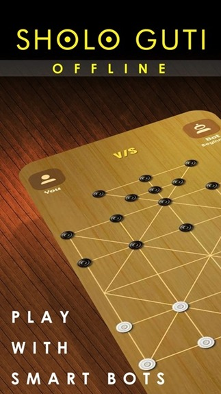
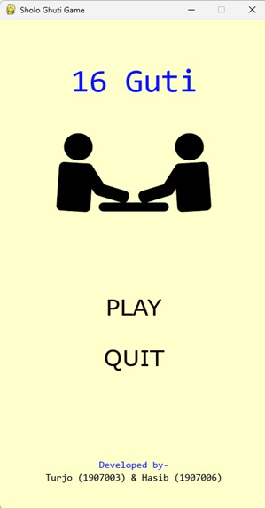
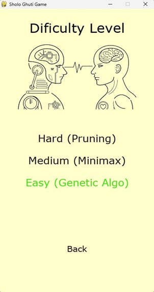
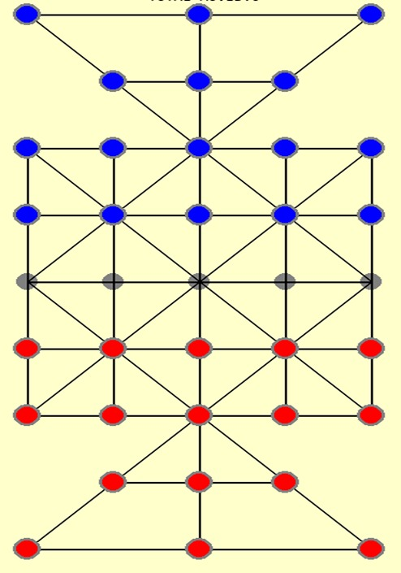

# 16-Ghuti-Game
A traditional board game of rural Bangladesh developed using python

## Algorithms used
1. **Alpha Beta Pruning**  

2. **Minimax**  

3. **Genetic Algorithm**  

4. **Mamdani Style Fuzzy Inference**  

## Game Features

1. **Initial Welcome Screen**  
   The game starts with a welcoming interface to greet the player.

2. **3 Levels of Difficulty**  
   The game offers three levels of difficulty, implemented using three different algorithmic approaches.

3. **Total Moves Counter**  
   Displays the total number of moves made during the game.

4. **Total Remaining Pieces (Human)**  
   Shows the total remaining pieces for the human player.

5. **Total Remaining Pieces (AI)**  
   Displays the total remaining pieces for the AI opponent.

6. **Valid Moves Highlighted**  
   All valid moves are highlighted with a green highlighter for better clarity.

7. **Double Kill**  
   Players can kill two opponent pieces if the situation allows.

8. **Winning Margin via Fuzzy Inference System**  
   Based on the number of remaining pieces and total moves, the game uses a fuzzy inference system to determine and display your winning margin.

9. **Portable Executable File**  
   The game is compiled into a portable `.exe` file, allowing it to run on any x64-based system without additional setup.

10. **Splash Screen Added**  
    A visually appealing splash screen has been added for a better user experience at startup.

## Screanshots

### Splash Screen

### Main Menu

### Difficulty level page

### Board

### Result page

